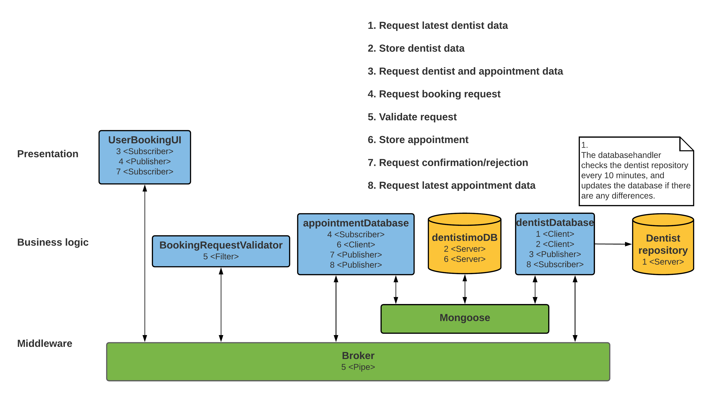

### Team 1
Simon Engström,
Emil Gustafsson,
Gustav Skallberg,
Mattias Ekdahl,
Annan Lao,
Peiran Wei,
Muradu Bedru

## Task description
We are developing a web application that will provide an easy to understand interface that anyone can use to book an appointment with a dentist.

## Links
* Project Trello Board: https://trello.com/b/gHtHcznV/dit-355-2020-team-1
* Request Generator: https://git.chalmers.se/courses/dit355/2020/group-1/requestgenerator
* Appointment Database: https://git.chalmers.se/courses/dit355/2020/group-1/appointmenthandler
* Booking Request Validator: https://git.chalmers.se/courses/dit355/2020/group-1/jsonvalidator
* User Booking UI: https://git.chalmers.se/courses/dit355/2020/group-1/dentistimo-front-end
* Dentist Database: https://git.chalmers.se/courses/dit355/2020/group-1/dentistimo

## Software Requirement Specification (SRS):

### Functional Requirements
1. A user shall be able to book a dentist appointment.  
  1.1. The user shall be able to view a selected date and it’s available time slots.  
  1.2. The user shall be prompted to fill in a form after selecting an available time slot.  
  1.3. When an appointment is successfully booked a confirmation message is returned by the system.  
  1.4. When an appointment fails to book a rejection message is returned by the system.  
  1.5. When a form has been completed, the user shall get a prompt booking successfully.
2. The system shall display dentistries on a map of Gothenburg.  
  2.1. The user shall be able to navigate the map by dragging and zooming.  
  2.2. The system shall display all dentistries on the map.  
  2.3. The system shall allow users to select a dentistry on the map.  
  2.4. When a user selects a dentistry on the map, information on the dentistry will show up.

### Non-Functional Requirements
1. The interface shall be accessible and easy to understand  
  1.1. Most of users understand the UI within 1 minute
2. The system does not crash.

## Software Architecture Document (SAD):

### The main forces that drive our system are:

### Availability
This system is being developed because there was found to be a need for a system that let users quickly and easily see available dentistries in one place. This makes availability a force that drives this system.

### Reliability
The dentistimo system should be highly stable since the quantity of both dentist and patient is huge. Pipe and Filter architecture filters the inappropriate data and prevents breakdowns because of errors from subsystems.
The system has a constraint that each component must be able to handle standard errors such as incorrectly formatted data, this means that reliability is a force that must drive our system. The publish and subscribe style is limited in how it guarantees deliveries since it uses different levels of quality of services where the more reliable options cost more bandwidth and therefore lower performance, however we choose to prioritize reliability for this project.

## Software Architecture
We intend to use a mix of different software architecture styles. The architecture styles we are planning on using are Client/Server style, Publish Subscribe, as well as Pipe and Filter. Client/Server will be used in order to receive the latest data from the dentistry repository. Publish Subscribe is used as the way we communicate between components, and Pipe and Filter will be used when filtering json data, making sure format is correct

Our plan is to base the backend of our web application on node.js, and use Mongoose to connect our backend to our mongodb database. The backend will be used to read and write from/to the database, it will then publish the data to the broker, which in turn communicates with the rest of the components who are subscribed.
We have decided on using the MQTT.js library.

We will use the JS framework react to create the user interface

 

 
 ER diagram for database 

 
 

 Functional Decomposition Diagram 

 UI Mockup 

 Architectural Overview 

## Program Management Report (PMR):
Our team schedule is as follows as of 2020-11-06:
Stand up meeting: every Monday
Weekly Checkpoint meetings Wednesday
Sum up meeting: every Friday

Our schedule as of 2020-11-19:
Stand up meeting: every Monday
Weekly Checkpoint meetings Thursday
Sum up meeting: every Friday
Meeting Saturday
Meeting Sunday

We are managing our project in a scrum-like fashion, with an aim to have incremental releases every week. We will assign a scrum master each week that handles makes the team stays on track.

